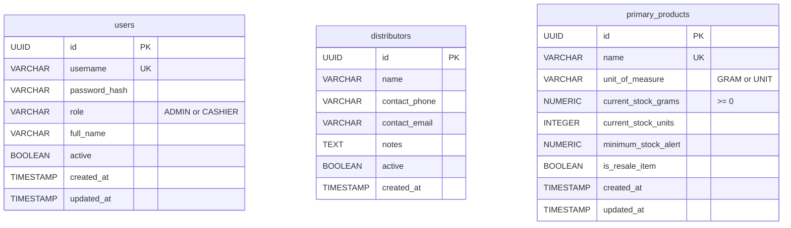

# Database Entity-Relationship Diagram

```mermaid
erDiagram
    users {
        UUID id PK
        VARCHAR username UK
        VARCHAR password_hash
        VARCHAR role "ADMIN or CASHIER"
        VARCHAR full_name
        BOOLEAN active
        TIMESTAMP created_at
        TIMESTAMP updated_at
    }

    distributors {
        UUID id PK
        VARCHAR name
        VARCHAR contact_phone
        VARCHAR contact_email
        TEXT notes
        BOOLEAN active
        TIMESTAMP created_at
    }

    primary_products {
        UUID id PK
        VARCHAR name UK
        VARCHAR unit_of_measure "GRAM or UNIT"
        NUMERIC current_stock_grams ">= 0"
        INTEGER current_stock_units
        NUMERIC minimum_stock_alert
        BOOLEAN is_resale_item
        TIMESTAMP created_at
        TIMESTAMP updated_at
    }
```
