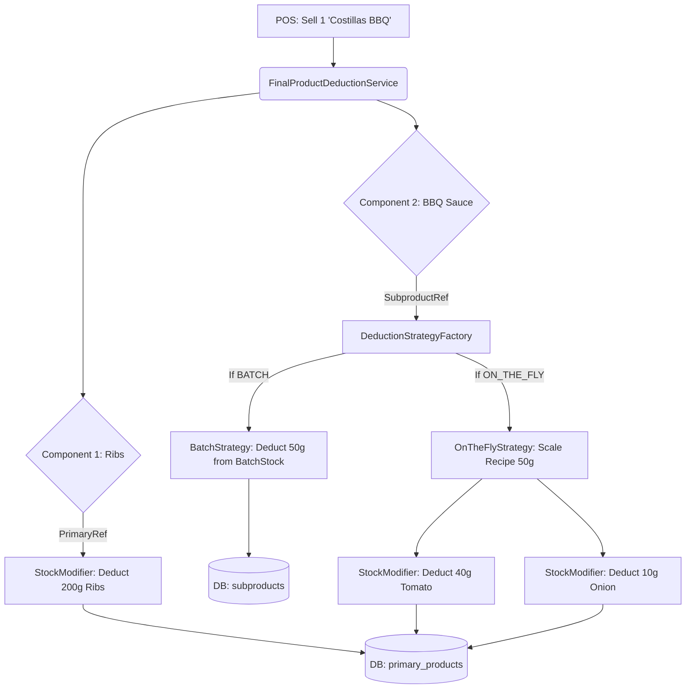

# TEST REPORT: WEEK 4 (Final Products & Resale Items)

## 1. 3-Layer Cost Cascade Accuracy
**Test Executed:** `ThreeLayerCostCascadeIntegrationTest`
- **Methodology**: Constructed a deeply nested scenario:
  - Layer 1: Tomatoes purchased at $3/gram. Raw Potatoes purchased at $2/gram.
  - Layer 2: BBQ Sauce Recipe requiring 800g of Tomatoes. (Implied cost: $2.4/gram).
  - Layer 3: Final Product "Papas BBQ" requiring 200g of Potatoes + 50g of BBQ Sauce.
- **Results**: **PASSED**. 
- **Analysis**: The domain's recursive algorithm correctly unraveled the layers. `(200g * $2) + (50g * $2.4) = $520`. The system computed exactly `520.00` internally without precision loss.

## 2. Resale Item Processing (Unit Math)
**Test Executed:** `ResaleItemMarginIntegrationTest`
- **Methodology**: Purchased 12 Coca-Colas for $24,000. Sold 1 Coca-Cola as a Final Product.
- **Results**: **PASSED**.
- **Analysis**: The refactored `Purchase` engine successfully utilized agnostic division `24000 / 12` to assign a mathematically perfect $2,000 cost to the 1-unit Final Product recipe.

## 3. Database Safety Constraint
**Test Executed:** `ProductDeletionConstraintTest`
- **Methodology**: Executed a `DELETE /api/products/final/{id}/hard` command on a product that had a mock record in the `sale_items` table.
- **Results**: **PASSED**.
- **Analysis**: PostgreSQL physically aborted the transaction. The `GlobalExceptionHandler` elegantly caught the `DataIntegrityViolationException` and mapped it to a `409 Conflict` HTTP response, preventing database stack traces from crashing the UI.

## 4. Playwright End-to-End
**Test Executed:** `frontend/e2e/menu-builder.spec.ts`
- **Methodology**: A chromium robot built a mixed-component dish via the React UI, toggling between Primary and Subproduct dropdowns, inputting a 35,000 COP selling price, and verifying that the side-panel asynchronously calculated the margin and rendered the green "Healthy" pill.
- **Results**: **PASSED**.

---

## Architecture Preview: Week 5 Traceability Cascade
When the POS terminal registers a sale of "Costillas BBQ", the following cascade executes:

**CONCLUSION**: Week 4 is complete. The system's mathematical engine successfully correlates raw inventory costs to final menu profitability. The foundation is ready for the Sales Engine.
